<h1 align="center">End-to-End E-commerce ETL Pipeline using AWS Glue, Amazon S3 and Snowflake</h1> 
<h3 align="center">Ruben Encinas Moreno</h3>

---

## Project Overview
This project demonstrates the design and implementation of an **end-to-end batch ETL data pipeline** for an **e-commerce clickstream and transactions dataset**, using **AWS Glue**, **Amazon S3**, and **Snowflake**.

The objective of the project is to ingest raw CSV data, transform it into analytics-ready Parquet format, and load it into a cloud data warehouse following **dimensional modeling best practices**.

- **Tools**: AWS S3, AWS Glue (PySpark), AWS IAM, Snowflake
- **Pipeline Type**: Batch ETL  
- **Focus**: Cloud data engineering, data lake architecture, and analytics-ready modeling

---

## Project Architecture 
The following diagram illustrates the complete data flow from raw source files to analytics-ready tables in Snowflake.

<p align="center"> 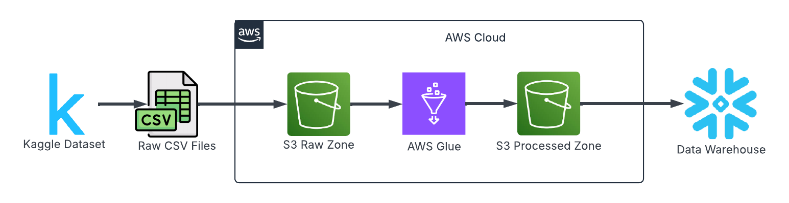 </p>

**High-level flow:**

1. Raw CSV files sourced from Kaggle
2. Data stored in Amazon S3 (Raw Zone)
3. Transformation using AWS Glue ETL jobs
4. Curated data written back to S3 in Parquet format (Processed Zone)
5. Data loaded into Snowflake for analytics and reporting

---

## Dataset Source
The dataset used in this project comes from Kaggle and represents e-commerce transactions, sessions, events, and customer interactions.

<p align="center"> 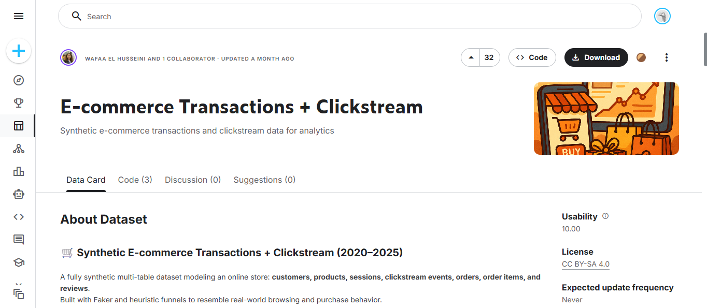 </p>

<p align="center"> 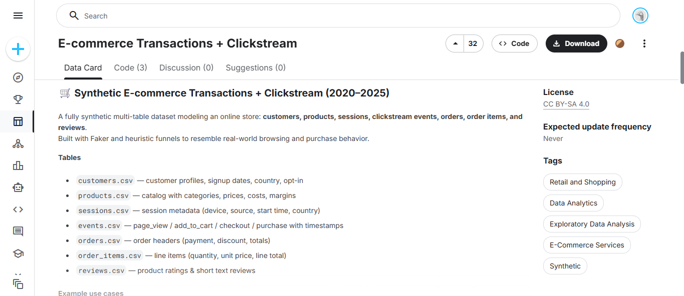 </p>

---

## Steps I Followed

### 1. Amazon S3 Setup (Raw and Processed Zones)
An Amazon S3 bucket was created to act as the data lake, with separate folders for raw and processed data.

<p align="center"> 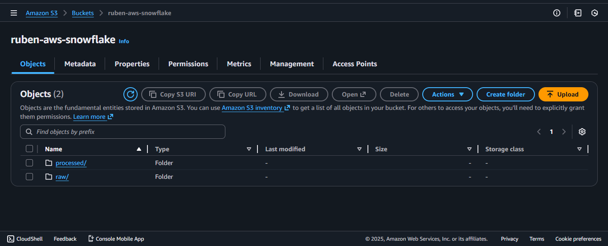 </p> 

<p align="center"> 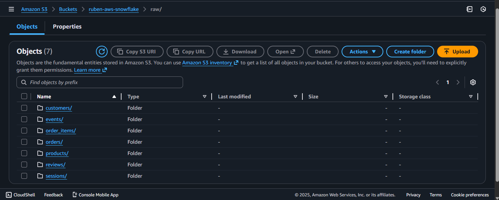 </p> 

<p align="center"> 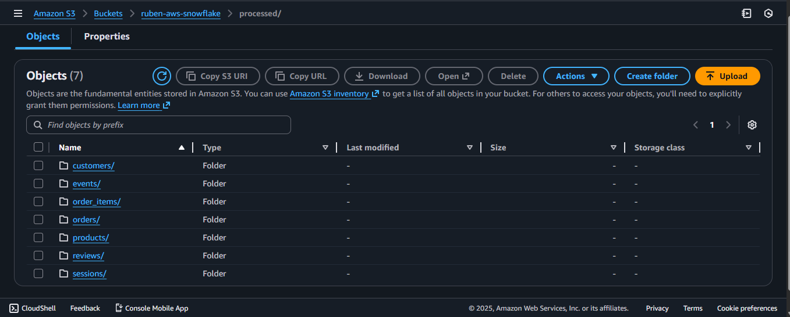 </p>

---

### 2. AWS Glue IAM Configuration
An IAM role was created to allow AWS Glue to read from the raw S3 zone and write transformed data to the processed zone.

<p align="center"> 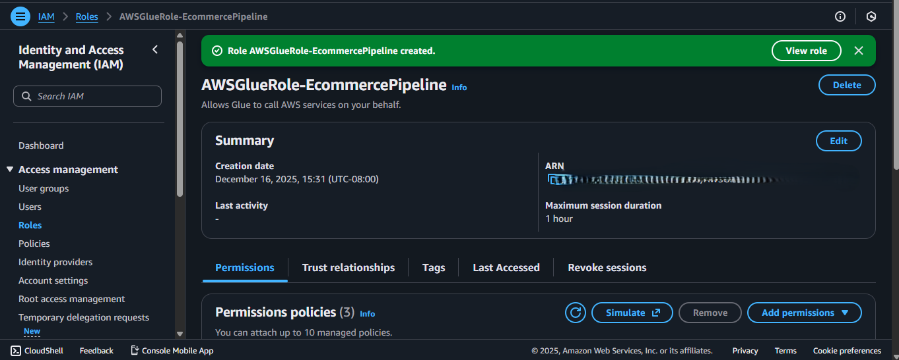 </p>

---

### 3. AWS Glue ETL Jobs (PySpark)
A separate AWS Glue job was created for each table.
The screenshot below shows the Glue job execution for the **customers** table as an example.

<p align="center"> 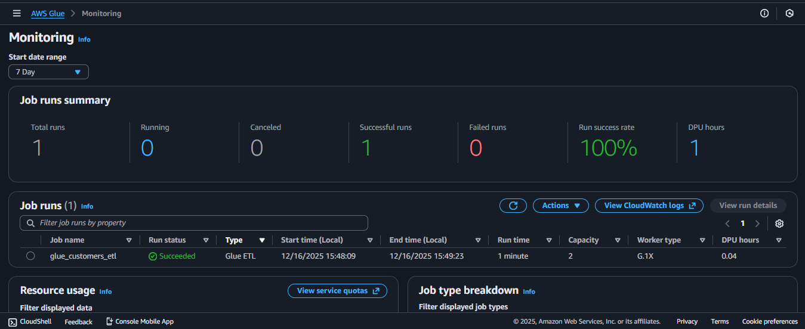 </p>

After transformation, the data is stored in Parquet format in the processed zone.

<p align="center"> 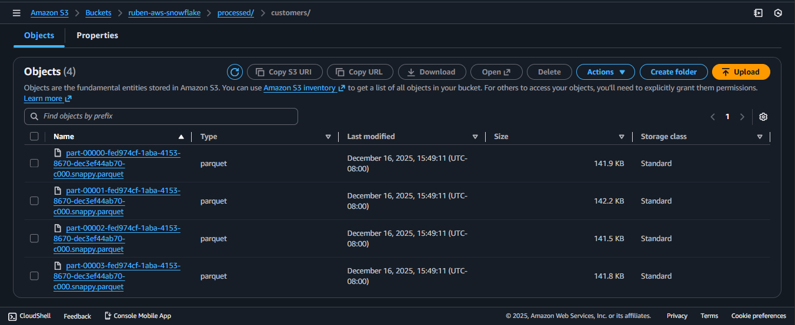 </p>

---

### 4. Snowflake Warehouse and Integration Setup
A Snowflake virtual warehouse was created to support data loading and querying.

<p align="center"> 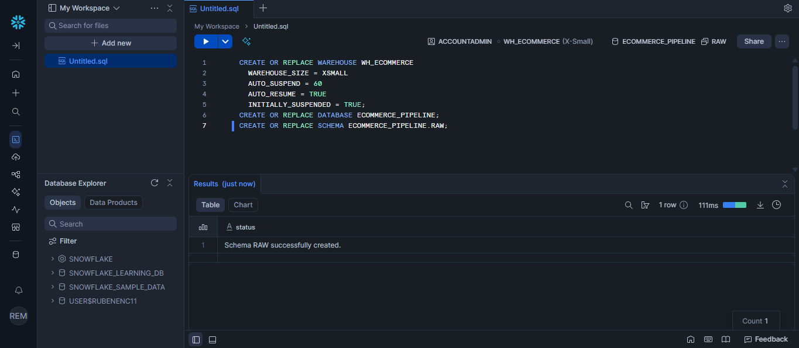 </p>

A storage integration was then configured to securely connect Snowflake with Amazon S3.

<p align="center"> 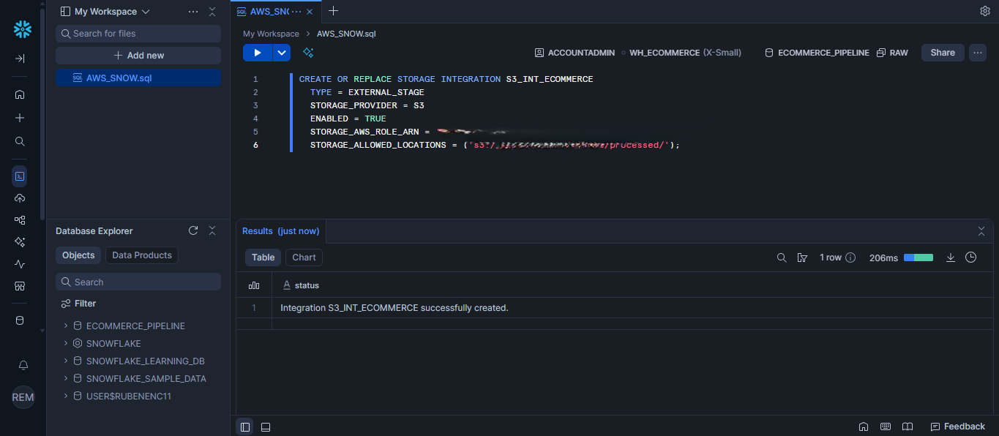 </p>

An IAM role was created in AWS to allow Snowflake read access to the processed S3 data.

<p align="center"> 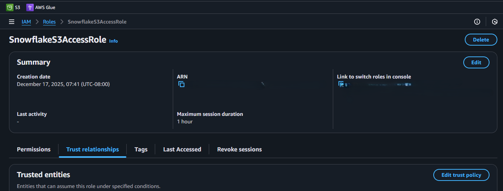 </p>

---

### 5. Snowflake External Stages and Tables
External stages were created in Snowflake to reference the processed Parquet files in S3.

<p align="center"> 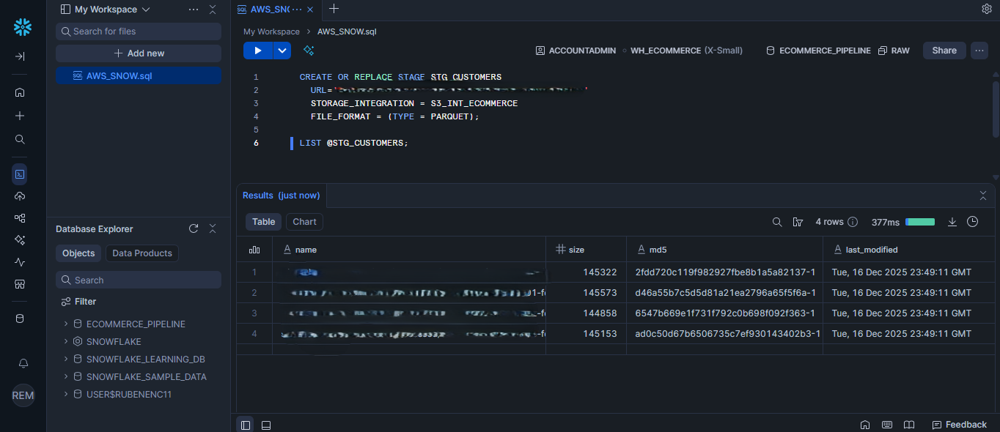 </p>

Dimension and fact tables were then created following a star schema design.

<p align="center"> 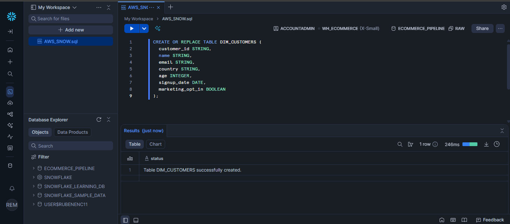 </p>

Data was loaded into Snowflake using `COPY INTO`.

<p align="center"> 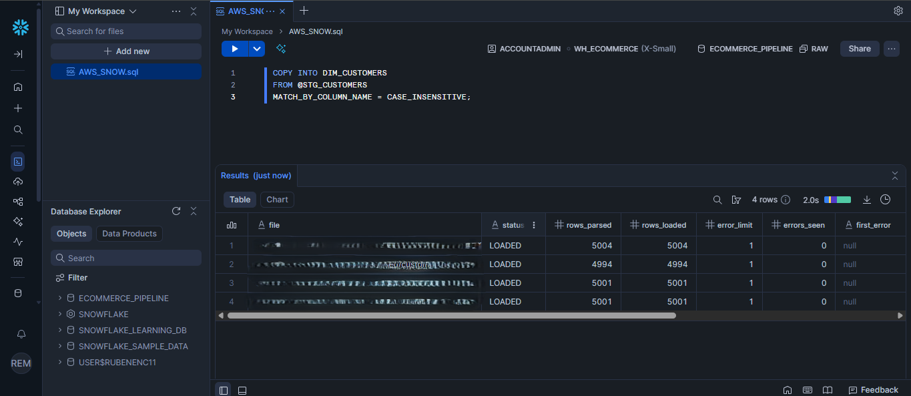 </p>

Once loaded, the data was validated using SELECT queries.

<p align="center"> 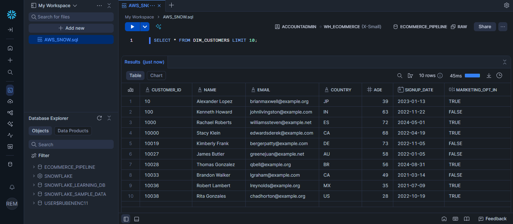 </p>

---

### 6. Data Quality Checks
Basic data quality validations were performed to ensure data integrity.

**Primary key validation:**

<p align="center"> 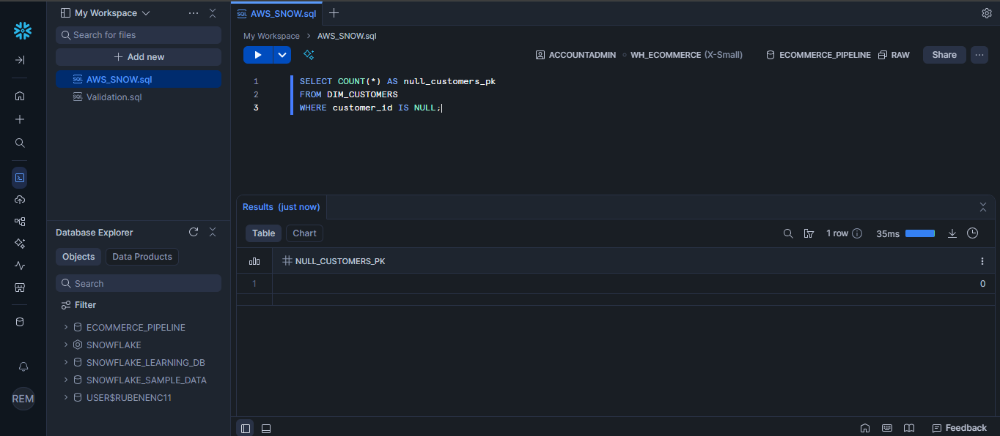 </p>

**Sanity check (orders vs order items):**

<p align="center"> 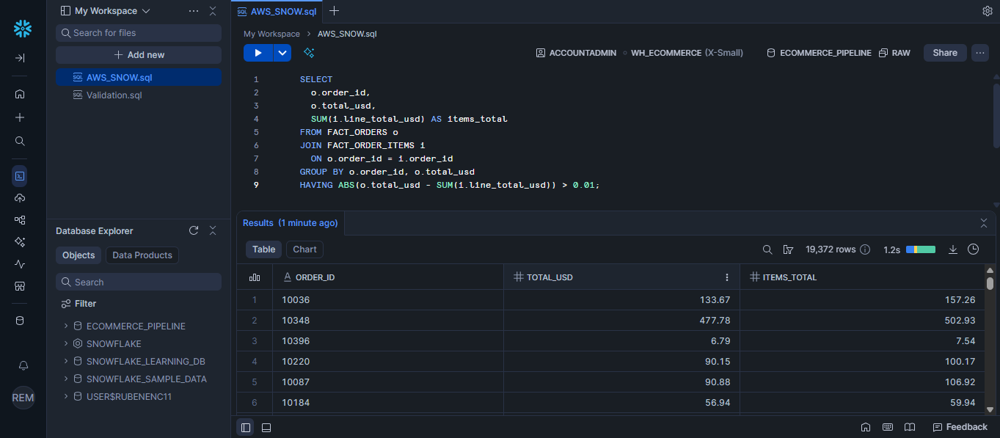 </p>

---

### 7. Analytics Views
Two analytical views were created to demonstrate business insights.

**Daily revenue view:**

<p align="center"> 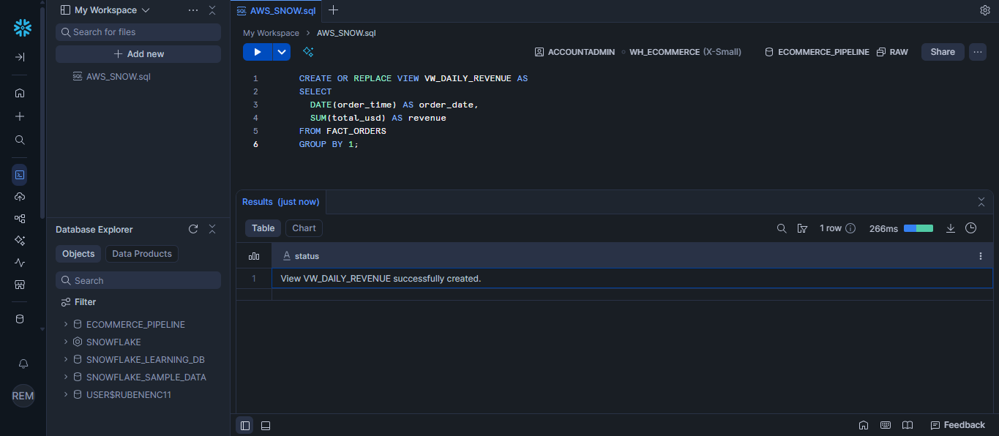 </p>

**Top products by revenue:**

<p align="center"> 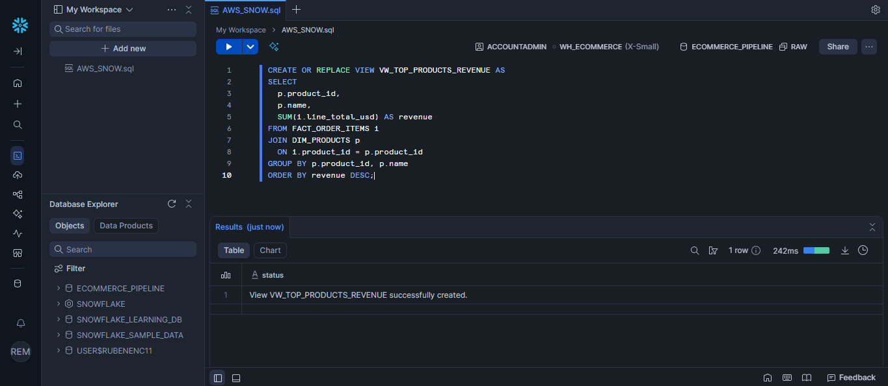 </p>

---

## Project Structure
```bash
aws-snowflake/
│
├── data/
│   └── raw/                         
│       ├── customers.csv
│       ├── products.csv
│       ├── orders.csv
│       ├── order_items.csv
│       ├── sessions.csv
│       ├── events.csv
│       └── reviews.csv
│
├── glue/                            
│   ├── customers/
│   │   └── glue_customers_etl.py
│   ├── products/
│   │   └── glue_products_etl.py
│   ├── orders/
│   │   └── glue_orders_etl.py
│   ├── order_items/
│   │   └── glue_order_items_etl.py
│   ├── sessions/
│   │   └── glue_sessions_etl.py
│   ├── events/
│   │   └── glue_events_etl.py
│   └── reviews/
│       └── glue_reviews_etl.py
│
├── snowflake/                       
│   ├── 00_setup/                    
│   ├── 01_integration/              
│   ├── 02_stages/                   
│   ├── 03_tables/                   
│   ├── 04_loads/                    
│   ├── 05_validation/               
│   └── 06_views/                    
│
├── images/                          
│
├── .gitignore
└── README.md
```

---

## Scripts Used

- **AWS Glue (PySpark)**  
  ETL logic for each table is implemented using AWS Glue jobs written in Python. These scripts handle data cleaning, type casting, and transformation from CSV to Parquet.

- **Snowflake (SQL)**  
  SQL scripts are used to create warehouses, storage integrations, external stages, dimension and fact tables, data quality validations, and analytics views.

---

## Learnings
- Designing **cloud-native ETL pipelines** using AWS services.
- Implementing **data lake architecture** with raw and processed zones.
- Writing **PySpark ETL jobs** with AWS Glue.
- Integrating **Snowflake with Amazon S3** using secure storage integrations.
- Applying **dimensional modeling** and validating data quality.

---

## Time Spent
~6 hours (design, implementation, debugging, and documentation).

---

## How to Reproduce
1. Clone this repository.
2. Upload raw CSV files to the S3 raw zone.
3. Run AWS Glue jobs to process the data.
4. Configure Snowflake storage integration and external stages.
5. Execute Snowflake SQL scripts to create tables, load data, and generate views.

---

## Credits
This project was completed as a **self-directed cloud data engineering portfolio project**.

Dataset source: Kaggle – E-commerce Transactions and Clickstream Data
